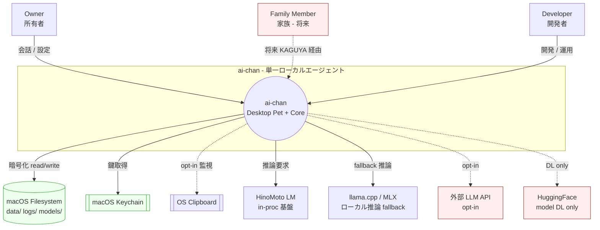
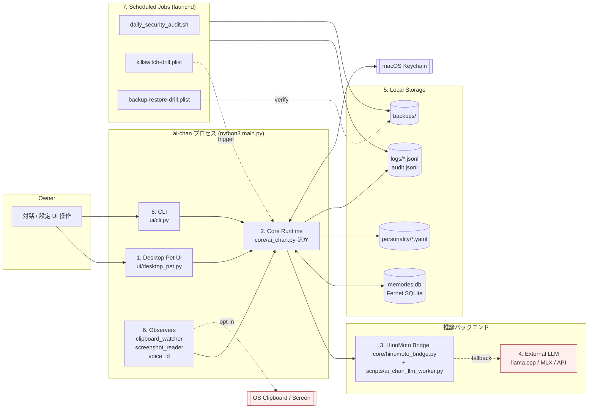
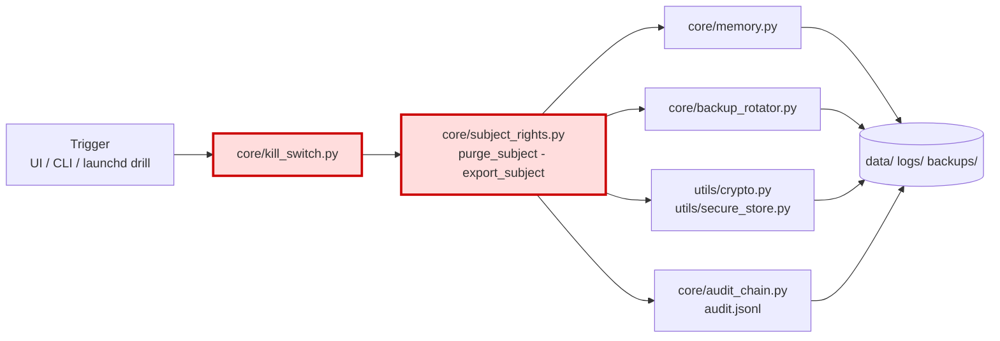
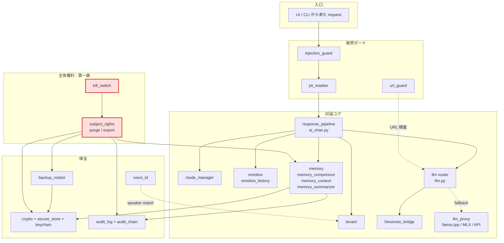
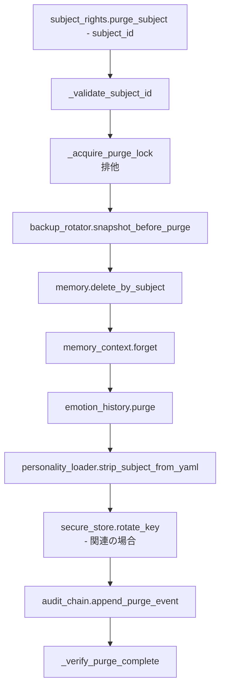
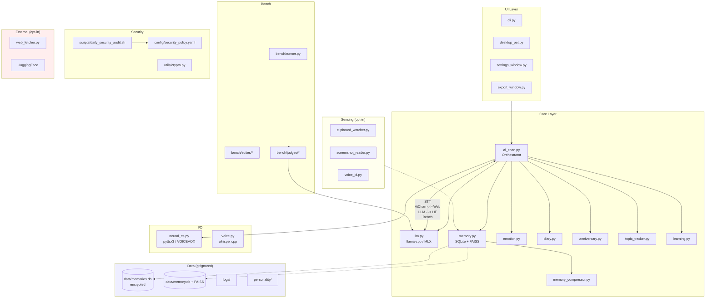
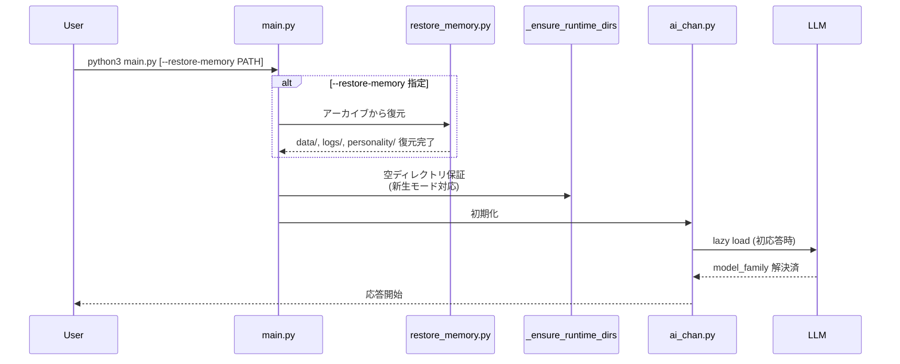
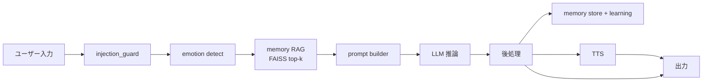

# ai-chan Architecture (C4 Model)

**Phase**: 0.75
**Last Updated**: 2026-04-23
**モデル**: C4 (Context / Container / Component / Code)

ai-chan は「家族として振る舞う AI パートナー」を目標にした **完全ローカル動作** の
会話エージェントである。本書は Simon Brown の C4 モデルに則り、4 階層で
アーキテクチャを説明する。旧来の単一レイヤ図は末尾「旧構成図 — 参考」に保存した。

参照 ADR は末尾「ADR 対応表」を参照。

---

## C1 — System Context (システムコンテキスト)

ai-chan を **1 つのブラックボックス** と見たとき、外界にどんなアクターと外部システムが
存在するかを描く層である。

### 関係者 (Actors)

| 種別 | 役割 | 実体 |
|---|---|---|
| Owner | 所有者・主な対話相手 | ローカル macOS ユーザー (honnsipittu 等) |
| Family Member | 所有者の家族 (将来) | KAGUYA (家族共有モデル) 経由で接続予定 (ADR 0002 / 0007) |
| Developer | 開発者・運用者 | 所有者自身 + OSS コントリビュータ |

### 外部システム

| 外部 | 関係 | 位置付け |
|---|---|---|
| macOS Filesystem | `data/`, `logs/`, `models/`, `backups/` を保存 | 信頼境界の内側 (暗号化 DB は Fernet で二重保護) |
| macOS Keychain | 暗号鍵の昇格保管 (`utils/keychain.py`) | OS 管理の信頼境界 |
| OS Clipboard | opt-in 観測対象 (`core/clipboard_watcher.py`) | 横断的チャネル、観測のみ |
| HinoMoto LM (in-proc) | 第一選択の対話基盤 | `core/hinomoto_bridge.py` 経由 (ADR 0005) |
| llama.cpp (GGUF) | ローカル推論フォールバック | `core/llm.py` 経由、Intel Mac 既定 |
| MLX | Apple Silicon 用フォールバック | Metal 非対応機では無効 |
| 外部 LLM (任意) | OpenAI 互換 API (opt-in) | ネットワーク越境、既定オフ |
| HuggingFace | モデル DL のみ | 対話には使わない |

### C1 図



### 信頼境界 (Trust Boundary)

- **内部状態** (信頼境界の内側): ai-chan プロセス自身、`data/memories.db` (Fernet)、
  `personality/`、`logs/`、macOS Keychain、launchd。
- **外部ネットワーク** (信頼境界の外側): 外部 LLM API、HuggingFace、web fetcher。
  いずれも既定無効、`config/settings.json` で明示有効化が必要。
- クリップボードと画面は **OS 管理領域** だが ai-chan 側では「半外部」として扱い、
  `core/injection_guard.py` + `core/pii_masker.py` を必ず通す。

---

## C2 — Container (コンテナ)

ai-chan を「同一ホスト上に同居する複数のランタイムコンテナ」として分解する。
Docker ではなく **実行時の分離単位** を指す C4 の "container" に倣う。

### コンテナ一覧

| # | コンテナ | 実体 | 言語 / RT |
|---|---|---|---|
| 1 | Desktop Pet UI | `ui/desktop_pet.py`, `ui/settings_window.py`, `ui/export_window.py` | Python / tkinter |
| 2 | Core Runtime | `core/*.py`, `main.py` | Python in-proc |
| 3 | HinoMoto LM Backend | `core/hinomoto_bridge.py` + `scripts/ai_chan_llm_worker.py` | 別プロセス worker (IPC) |
| 4 | External LLM Backends | `core/llm.py` (llama-cpp-python, MLX, OpenAI 互換) | in-proc or subprocess |
| 5 | Local Storage | `data/memories.db` (Fernet SQLite), `personality/*.yaml`, `logs/*.jsonl` | filesystem |
| 6 | Observers | `core/clipboard_watcher.py`, `core/screenshot_reader.py`, `core/voice_id.py` | in-proc daemon threads |
| 7 | Scheduled Jobs | `launchd/com.aichan.killswitch-drill.plist`, `com.aichan.backup-restore-drill.plist`, `scripts/daily_security_audit.sh` | launchd |
| 8 | CLI | `ui/cli.py` | Python |

### C2 図



### 主要データフロー

1. **会話経路**: Desktop Pet UI → Core Runtime → HinoMoto Bridge (第一選択) →
   失敗時 External LLM にフォールバック (ADR 0005)。
2. **記憶経路**: Core Runtime ↔ Local Storage (`memories.db` は Fernet 暗号化、
   鍵は `utils/keychain.py` 経由で Keychain に昇格保管)。
3. **監視経路**: Observers → Core (`injection_guard` / `pii_masker` 通過後) → 記憶へ。
4. **検証経路**: launchd Jobs → `scripts/killswitch_drill.sh` →
   `core/kill_switch.py` を発火 → `core/subject_rights.purge_subject()` をドライランで実行。

### Kill-Switch 経路

Kill-Switch はユーザーが「今すぐ止めて全て消したい」と望んだ時の **最優先経路** である
(ADR 0006)。通常の会話経路とは独立に以下を横断する。



Kill-Switch は **観測系・UI・LLM バックエンドを一切経由せず**、
Core 内部の `kill_switch → subject_rights → (memory, secure_store, backup_rotator) → audit_chain`
のみで完結する。外部 LLM を巻き込まない設計は「発火時にネットワークがあっても
止められること」を保証するため (ADR 0006)。

---

## C3 — Component (コンポーネント: Core の内部)

C2 の **Core Runtime** をズームインして内部コンポーネントに分解する。
Core は `core/` 配下の Python モジュール群で、in-proc で協調する。

### Core コンポーネント一覧

| コンポーネント | モジュール | 責務 |
|---|---|---|
| Orchestrator | `core/ai_chan.py` (歴史的)・`core/response_pipeline.py` | メッセージフロー統括 |
| Subject Rights | `core/subject_rights.py` | 「消す権利」「持ち出す権利」(purge / export) (ADR 0006) |
| Memory | `core/memory.py`, `core/memory_compressor.py`, `core/memory_context.py`, `core/memory_summarizer.py` | 長期記憶 read/write、圧縮、要約 |
| Emotion | `core/emotion.py`, `core/emotion_history.py` | 感情状態機械、履歴 |
| Tenant | `core/tenant.py` | マルチテナント分離 (AiChan / YAMATO / KAGUYA) |
| LLM Router | `core/llm.py`, `core/hinomoto_bridge.py`, `core/llm_proxy.py`, `core/llm_ipc_protocol.py`, `core/llm_worker_logger.py` | バックエンド切替 + フォールバック連鎖 (ADR 0005) |
| Encryption | `utils/crypto.py`, `utils/secure_store.py`, `utils/keychain.py` | Fernet 暗号化 / Keychain 連携 |
| Audit | `core/audit_log.py`, `core/audit_chain.py` | ハッシュ連鎖監査ログ |
| Backup | `core/backup_rotator.py` | ローテーション + ドリル |
| Kill-Switch | `core/kill_switch.py` | 緊急停止 + 破壊ドリル発火点 |
| Guards | `core/injection_guard.py`, `core/pii_masker.py`, `utils/url_guard.py` | プロンプト注入 / PII マスク |
| Mode Manager | `core/mode_manager.py` | 通常 / 省電力 / 家族 / 子供 モード切替 |
| Voice ID | `core/voice_id.py` | 話者識別 (opt-in) |

### C3 図 (Core 内部)



### 内部関係の要点

- **Memory は単独で暗号化しない**。`utils/crypto.py` + `utils/secure_store.py`
  を必ず経由する。鍵は `utils/keychain.py` → macOS Keychain。
- **LLM Router はフォールバック連鎖を持つ**: HinoMoto → llama.cpp (GGUF) → MLX →
  (opt-in) 外部 API。失敗記録は `llm_worker_logger.py` に残る (ADR 0005)。
- **Tenant は weights に触らない**。AiChan 個体の記憶・学習データが
  YAMATO / KAGUYA に漏れない境界を保証 (ADR 0002)。
- **Subject Rights は単なる delete 関数ではない**。Memory / Encryption / Backup /
  Audit の 4 箇所を横断する複合操作で、月次ドリル (launchd) で検証される (ADR 0006)。

---

## C4 — Code (コード: purge_subject() のサンプル)

C4 モデルの最下層。網羅はせず、最もクリティカルな **`subject_rights.purge_subject()`**
の呼び出しグラフのみを示す。

### purge_subject() 呼び出しグラフ



ASCII 等価 (mermaid が描画されない環境向けフォールバック):

```text
purge_subject(subject_id)
 └─ _validate_subject_id()
 └─ _acquire_purge_lock()
     └─ backup_rotator.snapshot_before_purge()
         └─ memory.delete_by_subject()         [core/memory.py]
             └─ memory_context.forget()        [core/memory_context.py]
                 └─ emotion_history.purge()    [core/emotion_history.py]
                     └─ personality_loader.strip_subject_from_yaml()
                                               [utils/personality_loader.py]
                         └─ secure_store.rotate_key()
                                               [utils/secure_store.py]
                             └─ audit_chain.append_purge_event()
                                               [core/audit_chain.py]
                                 └─ _verify_purge_complete()
```

### 関与する物理ファイル

| 操作 | 触るファイル |
|---|---|
| snapshot_before_purge | `backups/pre-purge-<ts>.tar.gz.enc` |
| memory.delete_by_subject | `data/memories.db` (SQLite 行削除 + VACUUM) |
| personality_loader.strip_subject_from_yaml | `personality/*.yaml` |
| secure_store.rotate_key | `data/.key`, macOS Keychain エントリ |
| audit_chain.append_purge_event | `logs/audit.jsonl` (hash-chained) |

### 月次ドリル (ADR 0006)

`launchd/com.aichan.killswitch-drill.plist` が月初に
`scripts/killswitch_drill.sh` を起動し、**ダミー subject** に対して
上記グラフを完全実行して `_verify_purge_complete()` が green を返すことを
`logs/audit.jsonl` に記録する。失敗時は `scripts/notify_mail.sh` が通知する。

---

## ADR 対応表

| ADR | タイトル | 本書での参照箇所 |
|---|---|---|
| [0002](adr/0002-corpus-isolation.md) | 学習コーパスの相隔離 | C2 Tenant, C3 Tenant コンポーネント |
| [0003](adr/0003-repetition-penalty-1-3.md) | repetition_penalty=1.3 | C3 LLM Router |
| [0004](adr/0004-fp16-over-int8.md) | fp16 優先 | C2 Backends |
| [0005](adr/0005-hinomoto-bridge-design.md) | HinoMotoBridge | C2 (3) / (4), C3 LLM Router |
| [0006](adr/0006-kill-switch-primacy.md) | 消す権利は第一級 | C2 Kill-Switch 経路, C3 Subject Rights, C4 全体 |
| [0007](adr/0007-model-family-naming.md) | モデルファミリ命名 | C1 Family Member, C2 Tenant |
| [0008](adr/0008-decoder-only-transformer.md) | Decoder-only 採用 | C2 (3) HinoMoto |
| [0009](adr/0009-sft-dolly-ja.md) | SFT に dolly-ja | C2 (3) HinoMoto |
| [0010](adr/0010-phased-coverage-floor.md) | 段階的カバレッジ | 本書範囲外 (CI 文書) |

---

## データ分類 (再掲)

| 分類 | 場所 | 暗号化 | git 追跡 |
|---|---|---|---|
| ソースコード | `core/` `utils/` `ui/` `bench/` | なし | あり |
| 設定例 | `config/*.example` `config/persona.json` | なし | あり |
| 実行時設定 | `config/settings.json` | なし | なし (gitignored) |
| 会話 DB | `data/memories.db` | Fernet | なし |
| 感情ログ | `data/emotion_history/` | なし | なし |
| 暗号鍵 | `data/.key` (chmod 0400), Keychain | 自己署名 | なし (*.key) |
| モデル | `models/*.gguf` | なし (バイナリ) | なし (サイズ上限) |
| 性格 | `personality/*.yaml` | なし | なし (切り離し対象) |
| 監査ログ | `logs/audit.jsonl` | hash-chained | なし |

詳細は [PRIVACY.md](../PRIVACY.md) を参照。

---

## 設計原則

1. **Local-first**: 全処理はローカル完結。外部通信は全て opt-in。
2. **Fail-safe**: モデル未 DL / data/ 空でも起動可 (新生モード)。
3. **Reversible**: Phase A/B/C で記憶の切り離し・復元が可能 (ADR 0006)。
4. **Auditable**: 監査ログ (`logs/audit.jsonl`) + 日次/週次スキャン。
5. **Isolated**: AiChan / YAMATO / KAGUYA は weights・記憶が相互に漏れない (ADR 0002)。
6. **Kill-Switch First**: 「消す権利」は他のどの機能より優先される (ADR 0006)。
7. **License-clean**: GPL/AGPL を自動検知 (`scripts/check_licenses.py`)。
8. **Reproducible**: `requirements.lock` でハッシュ固定、Dockerfile で再現環境。

---

## 旧構成図 — 参考

C4 導入前 (2026-04-20) の単一レイヤ図を参考として残す。レイヤ分割と C4 の
Container / Component の対応関係を把握するのに有用。

### 旧 全体構成図



### 旧 起動フロー (Mode C)



### 旧 データフロー (ユーザー入力 → 応答)



---

質問・貢献は [CONTRIBUTING.md](../CONTRIBUTING.md) を参照。
