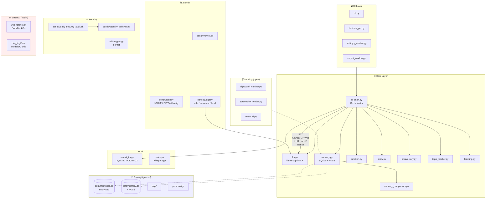
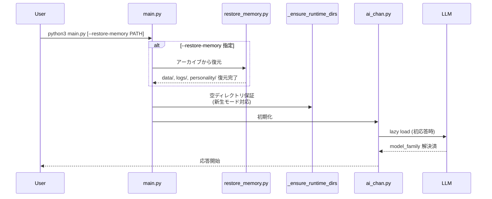
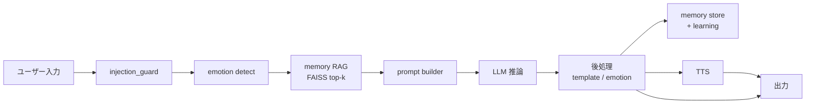

# ai-chan Architecture

**Phase**: 0.75
**Last Updated**: 2026-04-20

ai-chan は「家族として振る舞う AI パートナー」を目標にした
**完全ローカル動作**の会話エージェントです。

## 🏛 全体構成

## 🧭 レイヤ責務

| Layer | 責務 | ライフサイクル |
|---|---|---|
| **UI** | ユーザー入出力 (CLI / デスクトップペット) | アプリ起動〜終了 |
| **Core Orchestrator** (`ai_chan.py`) | メッセージフロー制御、全モジュール統括 | アプリ起動〜終了 |
| **LLM Backend** (`llm.py`) | llama-cpp-python / MLX のバックエンド抽象化、テンプレート切替 | 初回応答時に lazy load |
| **Memory** | SQLite + FAISS による長期記憶、暗号化 | オンデマンド |
| **Sensing** | クリップボード / スクリーン / 声紋 (全て **opt-in**) | `settings.json` で明示有効化時のみ |
| **I/O** | TTS (pyttsx3 デフォルト / VOICEVOX オプション) / STT (whisper.cpp) | 機能有効化時 |
| **Bench** | JGLUE / ELYZA-tasks-100 / family-dialog-100 の自動評価 | CI / 手動 |
| **Security** | 日次監査 (pip-audit / bandit / gitleaks) | launchd / GitHub Actions |

## 📡 起動フロー (Mode C)

## 🔐 データ分類

| 分類 | 場所 | 暗号化 | git 追跡 |
|---|---|---|---|
| ソースコード | `core/` `utils/` `ui/` `bench/` | ❌ | ✅ |
| 設定例 | `config/*.example` `config/persona.json` | ❌ | ✅ |
| 実行時設定 | `config/settings.json` | ❌ | ❌ (gitignored) |
| 会話 DB | `data/memories.db` | ✅ (Fernet) | ❌ |
| 感情ログ | `data/emotion_history/` | ❌ | ❌ |
| 暗号鍵 | `data/.key` (chmod 0400) | 自己署名 | ❌ (*.key) |
| モデル | `models/*.gguf` | ❌ (バイナリ) | ❌ (サイズ上限) |
| 性格 | `personality/*.yaml` | ❌ | ❌ (切り離し対象) |

詳細は [PRIVACY.md](../PRIVACY.md) を参照。

## 🔄 データフロー: ユーザー入力 → 応答

## 🎯 設計原則

1. **Local-first**: 全処理はローカル完結。外部通信は全て opt-in
2. **Fail-safe**: モデル未 DL / data/ 空でも起動可 (新生モード)
3. **Reversible**: Phase A/B/C で記憶の切り離し・復元が可能
4. **Auditable**: 監査ログ (`data/audit.jsonl`) + 日次/週次スキャン
5. **License-clean**: GPL/AGPL を自動検知 (`check_licenses.py`)
6. **Reproducible**: `requirements.lock` でハッシュ固定、Dockerfile で再現環境

## 🗺 Phase ロードマップ (詳細)

| Phase | 目標 | 主要成果物 |
|---|---|---|
| 0 | Rebrand + Baseline | Sarashina2-7B, bench stub, CI |
| 0.5 | Privacy + CI | PRIVACY.md, CI 4-job, lock file |
| **0.75** | **OSS Polish** | **LICENSE, CONTRIBUTING, Dockerfile, ARCHITECTURE** |
| 1 | Bench Real | rule/semantic/local judges, JGLUE 実走 |
| 2 | Prompt Eng | RAG, few-shot, ensemble |
| 3+ | Fine-tune | LoRA (GPU 必要) |

---

質問・貢献は [CONTRIBUTING.md](../CONTRIBUTING.md) を参照。
