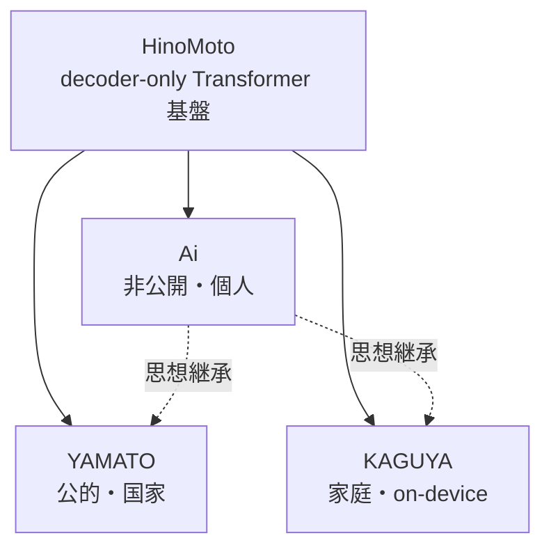

# HinoMoto モデルファミリー (ai-chan 側マスター)

> このドキュメントは HinoMoto 系モデルの設計差分・系譜・派生ブランチの **ai-chan 側の正典** (source of truth) である。
> hinomoto-model リポジトリ側 (`hinomoto-model/docs/MODEL_FAMILY.md`) と整合性が保たれていることを
> `scripts/audit_model_family.py` (Data-Truth-Audit; DTA) が検証する。

---

## 概要

**HinoMoto** は decoder-only Transformer の基盤モデル。
ここから用途ごとに 3 つの派生モデルが生まれる:

- **Ai** — 非公開・開発者本人専用 (ai-chan の中核・魂の継承先)
- **YAMATO** — 公的用途 (国家・公共機関)
- **KAGUYA** — 一般家庭用 (on-device / 普及版)

```
                    HinoMoto (基盤)
                         │
        ┌────────────────┼────────────────┐
        │                │                │
       Ai             YAMATO           KAGUYA
  (個人・非公開)   (公的・審査配布)  (家庭・on-device)
        │
        ├─→ YAMATO の母 (思想・魂の継承元)
        └─→ KAGUYA の設計思想の源
```



---

## モデル一覧表 (Data-Truth Table)

> この表は DTA の照合対象。列名と行名は hinomoto-model 側と一致させる。
> 値が未確定のものは `[TBD]` と書く (audit がカウントする)。

| モデル名 | 公開範囲 | vocab | d_model | n_layers | パラメータ数 | 学習コーパス | ライセンス | 想定ユーザ |
|---|---|---|---|---|---|---|---|---|
| HinoMoto-v1 | 研究内部 | 8000 | 256 | 8 | 5.3M (excl embed) | 日本語 Wikipedia (小規模 smoke) | Apache-2.0 (code) / weights TBD | 研究者・開発者 |
| HinoMoto-scaled_v3 | 研究内部 (予定) | [TBD] | 512 | 12 | ~40M (excl embed, 想定) | 日本語 Wikipedia 拡張 + 公開文書 | Apache-2.0 (code) / weights TBD | 研究者・開発者 |
| Ai | 非公開 (開発者本人のみ) | [TBD] | [TBD] | [TBD] | [TBD] | 開発者本人の対話・日記・学習履歴のみ | Private / 配布しない | 開発者本人ただ一人 |
| YAMATO | 審査配布 (公的機関) | [TBD] | [TBD] | [TBD] | [TBD] | 日本の公開文書・公共データ (同意ベース) | [TBD] (公的配布向け) | 国民・公共機関・国家インフラ |
| KAGUYA | on-device 配布 | [TBD] | [TBD] | [TBD] | [TBD] (~3B core + 外部記憶 想定) | 家庭会話 synthetic + opt-in 同意・日本文化 | [TBD] (家庭配布向け) | 一般家庭 (子ども〜高齢者) |

---

## 設計差分の根拠

### HinoMoto (基盤)
- アーキテクチャ: RoPE / RMSNorm / SwiGLU / MHA の自前実装
- 派生の土台。ここを変えると全派生に波及する。

### Ai (個人)
- HinoMoto から **fine-tune** で派生。
- 学習データは開発者本人の発話・日記・学習履歴のみ。
- **配布しない**。家から出ない。
- ai-chan 時代の 4 層記憶と敬語処理を最も純度高く継承する。

### YAMATO (公的)
- Ai の思想を継ぎつつ、規模と検証性を優先。
- 敬語階層 (柱 2) を最も厳密に実装する想定。
- 配布は厳格な審査を経た機関へ。

### KAGUYA (家庭)
- on-device 動作前提 (柱 3: Small-Core Big-Memory)。
- 小さい core + 外部記憶。家庭ごとに閉じた記憶。
- 敬語と方言の両立、沈黙を家族対話で活かす。

---

## 追記ルール

新しいモデル行を追加する時は:

1. **日本語由来の名前** を選ぶ。
2. 表の全列を埋める。未定は `[TBD]` にする。
3. `hinomoto-model/docs/MODEL_FAMILY.md` の表も同時に更新する。
4. `python scripts/audit_model_family.py` を実行し、矛盾が無いことを確認する。

---

## 関連ドキュメント

- [MODEL_BASELINE.md](./MODEL_BASELINE.md) — ai-chan 時代の現行モデル計測結果
- [MODEL_POLICY.md](./MODEL_POLICY.md) — モデル運用ポリシー
- [quality/MODEL_FAMILY_DTA.md](./quality/MODEL_FAMILY_DTA.md) — DTA 運用フロー
- `hinomoto-model/docs/MODEL_FAMILY.md` — 姉妹リポジトリ側の記述
